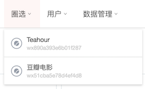

# 指标圈选定义

### 事件定义

在SDK 采集数据和逻辑一节中，我们介绍了小程序 SDK [无埋点采集事件](../tag-management/sdk-logic/autotrack.md)的逻辑，支持采集 visit、page、action 事件。针对无埋点采集的行为事件，为了后续能在分析功能如事件分析、漏斗分析、留存分析等中使用，同 Web 和移动的指标定义一样，GrowingIO 也提供了小程序指标圈选定义功能。使用小程序圈选定义指标，可以快速建立小程序上的指标体系，并以此构建分析体系，即时进行数据监测和分析。

通过圈选定义的指标，分成两类：

* 页面指标
* 行为指标

登录到 GrowingIO 的项目里，从菜单上的圈选-&gt;小程序即可进入到指标圈选定义功能。

### 实时调试

不清楚关注页面的页面路径、按钮的函数名称？可以进入实时调试模式，根据交互操作，查看页面路径和点击元素的函数名称。详情请见[小程序数据校验Debugger](../tag-management/xiao-cheng-xu-shu-ju-xiao-yan-debugger.md)。

