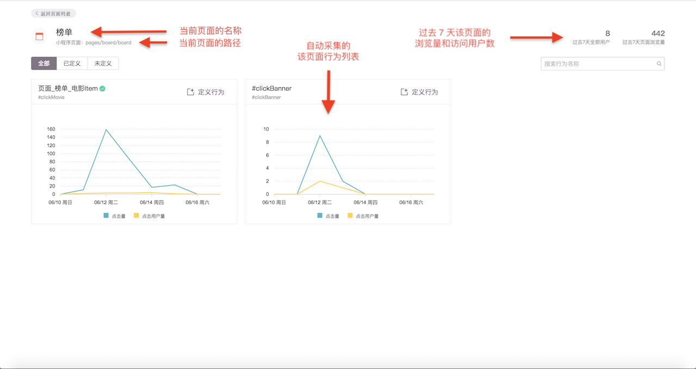
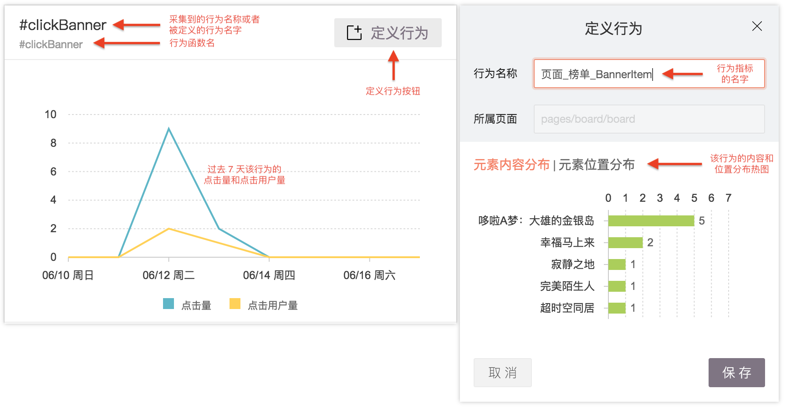

# 行为指标定义

进入页面的行为圈选页面后，显示的是该页面所有自动采集到的行为页面。在这个页面，你可以看到以下信息：

1. 当前小程序页面的页面名称
2. 当前小程序页面的页面路径
3. 当前小程序页面的过去 7 天数据表现
4. 当前小程序页面自动采集到的行为列表及其数据

 从上图的样例可以看到，GrowingIO 小程序在榜单页面自动采集到 2 个行为，每个行为的具体点击趋势显示在列表内。如果要定义某个行为为指标用于后续分析，点击“**定义行为**“按钮，然后可以看到弹出框，如下图。

输入行为名称，点击保存，就定义好了一个行为指标。之后，就可以在分析工具里面使用这个指标了。

这里值得注意的是元素内容分布和元素位置分布，显示的数据是在这个页面，行为被点击/输入时，对应的内容和位置的交互热图分布。在[无埋点采集事件](../tag-management/sdk-logic/autotrack.md#tap)里介绍了，如果在视图里使用了 data-title 和 data-index 这种声明式编程，就能在行为数据里看到这些数据。

