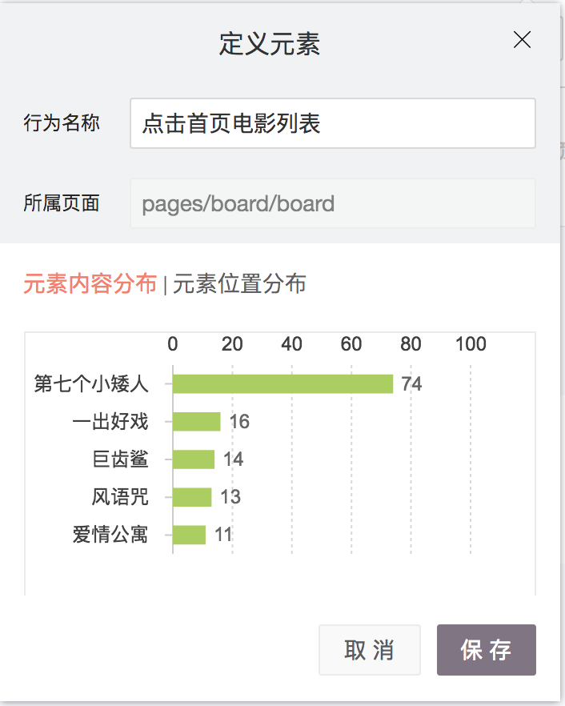

# 交互式圈选

交互式圈选，主要帮助产品、运营、市场等非技术人员，来根据业务含义定义页面浏览和元素点击事件。

## 交互式圈选功能使用

进入圈选功能后，点击“交互式圈选”入口按钮。

step1 进入交互式圈选页面，请扫码将手机IP加入后，打开微信小程序。就能看到微信头像出现在下方。（如果没有显示微信头像，是因为没有授权openid，请查看SDK配置：）

选择自己的头像（设备），点击“开始圈选”。

在这个页面中，在微信小程序上实时操作，你的页面浏览或者元素点击事件的行为流会实时的显示在页面上。

点击“定义元素”，会出现这个元素信息的弹窗。其中如果元素存在内容和位置的属性，就会展示“元素内容分布”和“元素内容分布”的信息，帮助你了解这个点击事件代表采集的具体数据。如下图，点击了“电影列表”，其中也采集到了这个元素后的内容属性和位置属性（为什么我没有看到元素的内容和属性数据？可能是元素代码信息标注不完全，详细请见小程序SDK高级配置）。

在行为名称上给行为命名，然后点击保存。这个事件就被定义为指标了。  

同理定义一个页面，点击“定义页面”，展示出定义页面的弹窗，“元素点击分布”tab上，展示这个页面上所有元素的点击分布，如果页面上没有可点击的元素，则显示为空。

给页面定义一个名称，保存。

圈选页面上，定义的内容会自动变成“已定义”的标识，并展示这个指标的名称。

## 圈选定义的指标的管理

定义完后的指标，会出现在“数据管理-圈选指标“功能页面中。可以进行创建人等信息的查看。

## 使用圈选定义的指标

圈选指标，会自动出现在**”事件分析“、”漏斗分析”、“留存分析”**  的**“选择指标-我的指标分类”** 中，或者可以直接使用搜索进行查找。可以选择已圈选的指标，进行进一步的数据分析。

