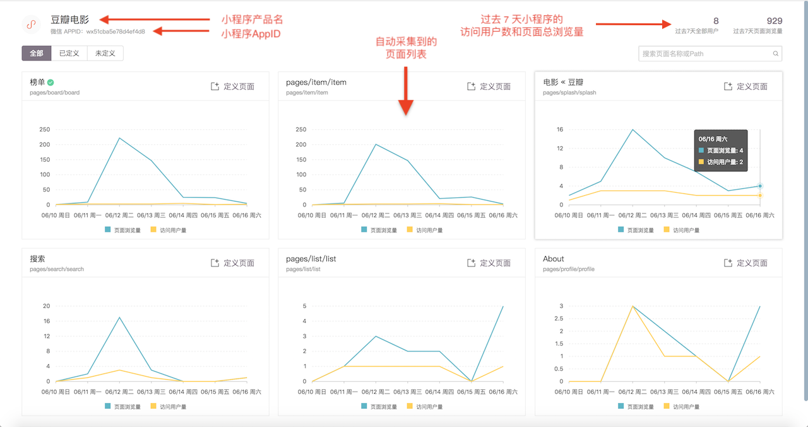

# 页面指标定义

进入圈选页面后，显示的是所有自动采集到的页面。在这个页面，你可以看到以下信息：

1. 当前要圈选的小程序的产品名
2. 当前要圈选的小程序的 AppID
3. 当前要圈选的小程序的过去 7 天数据表现
4. 当前要圈选的小程序自动采集到的页面列表及其数据

从上图的样例可以看到，GrowingIO 小程序自动采集到 6 个页面，每个页面的具体访问趋势显示在列表内。如果要定义某个页面为指标用于后续分析，点击“**定义页面**“按钮，然后可以看到弹出框，如下图。

输入页面名称，点击保存，就定义好了一个页面指标。之后，就可以在分析工具里面使用这个指标了。

这里值得注意的是元素点击分布，显示的数据是在这个页面，行为被点击/输入的次数，可以理解成为简易的交互热图分布。

点击具体页面的容器区域，就会进入到该页面的行为指标定义页面，具体见下一节。

