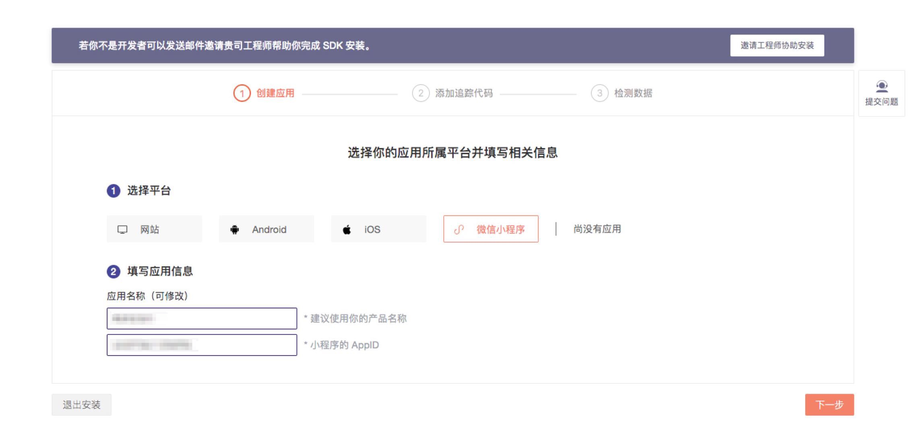
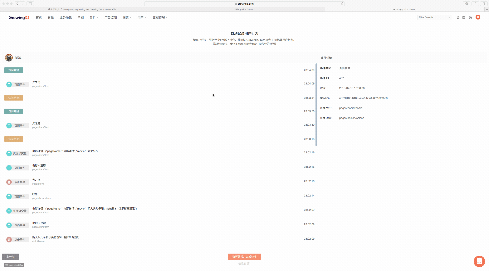

# 小程序数据校验Debugger

数据校验Debugger功能，可以支持用户根据自己的交互体验，实时看到GrowingIO采集的数据，完成数据收集的校验。

在完成SDK集成，点击“检测数据”，会跳转进入小程序Debugger的页面。

进入Debugger页面后：

1. 保证操作集成小程序SDK的手机和登录GrowingIO的电脑处在同一网络（WiFi）环境下。
2. 打开微信，进入集成了小程序SDK的小程序中。
3. 等待5秒左右，可以看到用户显示在页面中。

在小程序Debugger页面，会展示目前接入Debugger实时传输数据的小程序用户，以及部分用户微信信息、设备、操作系统的信息。但是部分信息的展示，需要在SDK中设置微信用户属性设置。详情请见[SDK 微信用户属性设置](sdk-logic/wechat_user_atrributes_setting.md)。

选择自己的用户头像，点击“下一步”，进入用户行为记录页面。

和小程序产生交互（访问、页面浏览、点击等），即在此页面可以看到数据行为的记录。

